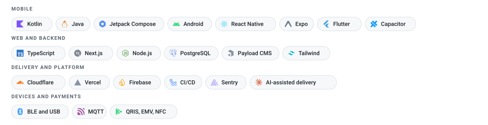

<picture>
  <source media="(prefers-color-scheme: dark)" srcset="assets/hero-dark.svg">
  
</picture>

  <a href="https://astu.app"><picture><source media="(prefers-color-scheme: dark)" srcset="assets/btn-portfolio-dark.svg"></picture></a>
  <a href="https://play.google.com/store/apps/dev?id=8721309729295189926"><picture><source media="(prefers-color-scheme: dark)" srcset="assets/btn-play-dark.svg"></picture></a>
  <a href="https://github.com/anggastudio/Printama"><picture><source media="(prefers-color-scheme: dark)" srcset="assets/btn-printama-dark.svg"></picture></a>
  <a href="https://mobiledev.id"><picture><source media="(prefers-color-scheme: dark)" srcset="assets/btn-community-dark.svg"></picture></a>
  <a href="https://linkedin.com/in/aaanggapratama"><picture><source media="(prefers-color-scheme: dark)" srcset="assets/btn-linkedin-dark.svg"></picture></a>

Mobile engineering since 2016, mostly in places where nobody can restart the app by hand when it breaks: payment terminals sitting on merchant counters, transaction flows that move real money, and consumer apps that ship on their own schedule. Native Android is the foundation, React Native and Expo are the daily stack, and I take the backend and the release pipeline too when a product needs one person to carry it end to end. The work I enjoy most is the unglamorous part: timeouts, retries, half-finished transactions, and the gap between what a vendor spec promises and what the device in the shop actually does.

<picture>
  <source media="(prefers-color-scheme: dark)" srcset="assets/stack-dark.svg">
  
</picture>

### Printama

Android library for Bluetooth thermal printers, tested on 2 and 3 inch hardware, documented thoroughly enough that people ship with it without asking me first. That was the whole point. 130+ stars, 38 forks. [Repository](https://github.com/anggastudio/Printama) · [Sample app on Play Store](https://play.google.com/store/apps/details?id=com.anggastudio.printama_sample)

### astu.app

My workshop, and where an idea gets tested before it earns the right to become a product: 34 published projects, made of 19 developer tools (JSON formatter, prompt generator, and the rest of the daily kit), 11 browser games, 2 apps, and 2 devkits. Built for real workflows, mine first. [astu.app](https://astu.app) · [Cacing Naga](https://cacingnaga.astu.app) · [Red Snake](https://redsnake.astu.app)

### Google Play portfolio

15 applications on my own developer account. The biggest piece is a crossword series of 9 apps generated from a single React Native and Expo codebase in a pnpm monorepo: one shared engine, nine content sets. The rest are Flutter titles (aranim, JemBooth, Arowes, 2048 Pixel) and Chess Timer Switcher. [Developer page](https://play.google.com/store/apps/dev?id=8721309729295189926) · [2048 Pixel](https://play.google.com/store/apps/details?id=com.anggastudio.game2048pixel)

### Payments and hardware

Android transaction systems on 400+ merchant terminals across WizarPOS, PAX, Centerm, and Topwise devices, handling QRIS, EMV chip, NFC contactless, and magnetic stripe. Four vendors reading the same spec four different ways, thousands of financial transactions a month, and nobody on site to restart anything.

### mobiledev.id

A community platform for Indonesian mobile developers, built and run alone: backend, frontend, database, media storage, email, performance, and security. It records community events and gives developers a portfolio page for their apps. 350+ registered developers, 3 communities running themselves on it, and a hosting move from Vercel to Cloudflare with no downtime that cut running cost by 75%. [mobiledev.id](https://mobiledev.id)

### Community and writing

Community manager of Android Enthusiast Jakarta since 2018, founder of Mobile DEV Generalist (a WhatsApp group of 1000+ members running weekly events with volunteer speakers), speaker at 4 developer events, moderator at 7 in the Mobile Dev Talk series. Posts, decks, and notes on building reliable mobile systems live at [anggastudio.dev](https://anggastudio.dev).
